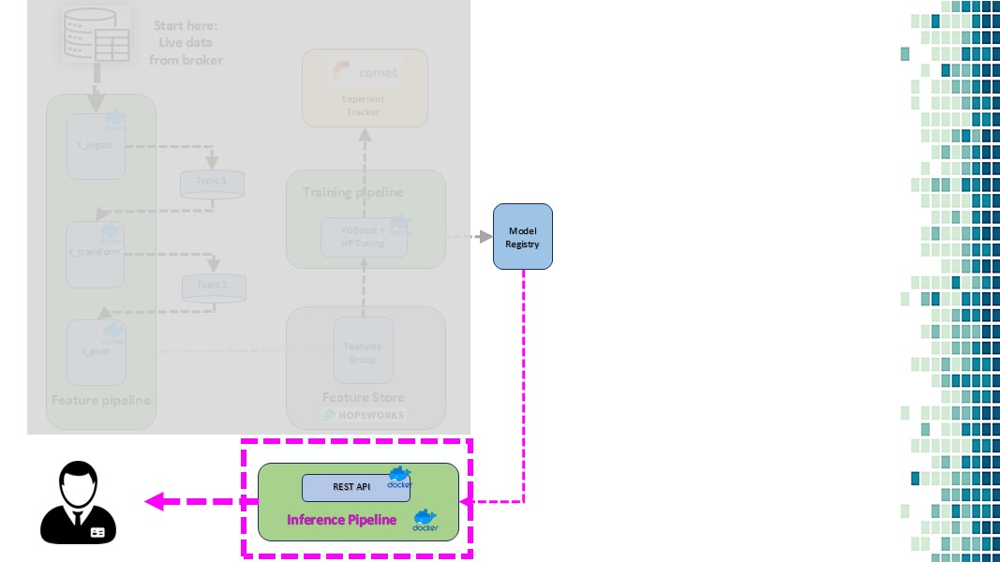

# Project: Predict Bitcoin Price

This repository contains code and resources to predict Bitcoin prices.

## Overview

  
Hi, I’m Carrick. I’m excited to share how we can build a real-time machine learning system for Bitcoin price prediction.  

## System Design

  
Here’s a quick look at the system’s basic design. The goal is to make the process efficient, scalable, and suitable for real-time predictions.  

Our system revolves around 3 main components:  

Feature Pipeline – Prepares and transforms raw data.  
Training Pipeline – Builds and optimizes the machine learning models.  
Inference Pipeline – Delivers real-time predictions. Let’s look at each in detail.

## Feature pipeline

  
The feature pipeline consists of 3 microservices:

t_ingest: It connects to the broker’s WebSocket, fetches live data, and sends it to Kafka.  
t_transform: This service processes the raw data into OHLC format.  
t_push: Finally, it pushes the cleaned data to the feature store.  
Once built, these microservices are dockerized to ensure seamless integration and scalability.  

## Training pipeline

  
In the training pipeline, we use an XGBoost model to train our data.  
We also tune hyperparameters and leverage CometML to track experiments.  
Afterward, the best-performing model is pushed to a model registry for deployment.  

## Inference pipeline

  
For the inference pipeline, we deploy a REST API that serves real-time predictions.  
Additionally, we set up a training job to ensure the model remains up-to-date with fresh data.  

## Total microservices in the system

Within this system, we're going to build five microservices. These microservices will handle the core functionalities of the system, ensuring modularity and scalability.  

## Engineerng data

  
First, let’s build the feature pipeline, which consists of three microservices:  

t_ingest: This connects to the broker’s WebSocket, downloads data, and sends it to Kafka topic 1.  
t_transform: This microservice processes and transforms the data into OHLC format.  
t_push: It pushes the processed data to the feature store.  
After building these services, we’ll dockerize them to streamline deployment and integration.  

## Train and Retrain for Continuous Improvement

  
In the training pipeline, we train the data using an XGBoost model.  

We fine-tune the model with hyperparameter optimization.  
CometML is used to track experiments and manage retraining.  
The best-performing model is then pushed to the model registry for deployment.  

## Build rest-api

  
In the inference pipeline, we deploy the REST API to serve predictions.  

Real-time features are deployed to the cloud to ensure fast and reliable predictions.  
Additionally, we deploy a training job to keep the model updated with fresh data, maintaining performance over time.  

## Deployment on cloud

  
Finally, the entire system is deployed to Quix Cloud. With this setup, we can serve predictions seamlessly via the API we built.  
The system is now fully operational and ready for real-time use.  

## Thank You

  
Thank you! If you'd like to exchange feedback or discuss this project further, feel free to connect with me. I look forward to hearing your thoughts.  
