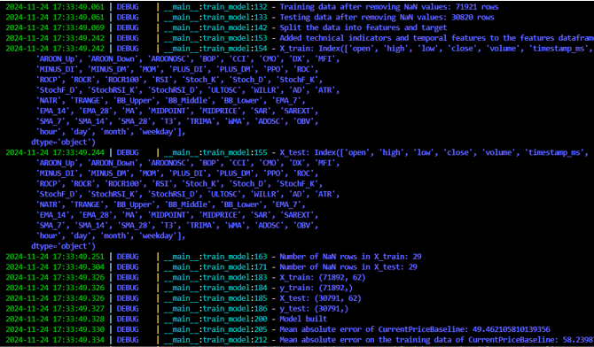
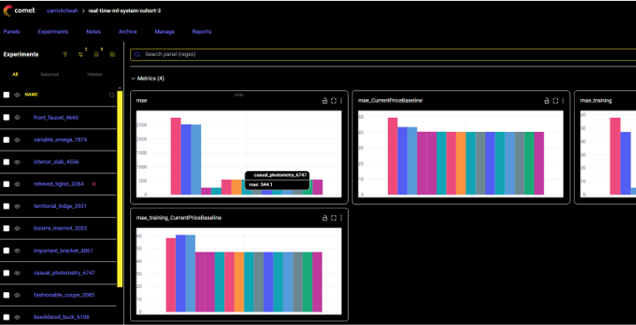
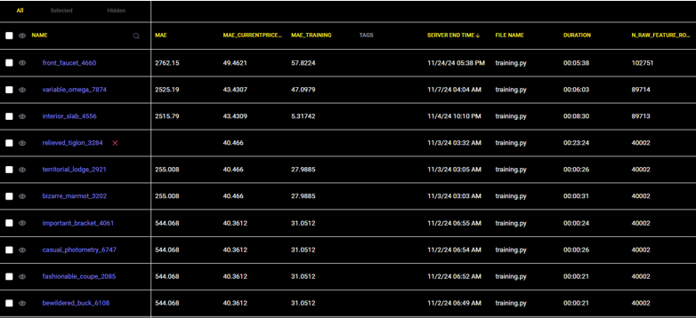

# Project: Real-time ML predict BTC with XGboost

This project develops a real-time machine learning system for Bitcoin price prediction, using Redpanda-based pipelines, XGBoost for training, REST APIs for predictions, and scalable cloud deployment.

## Overview

  
**Table of contents**  
1.Project Overview  
2.System Design  
3.Feature Pipeline  
4.Training Pipeline  
5.Inference Pipeline  
6.Microservices in the System  
7.Engineering Data  
8.Train and Retrain for Continuous Improvement  
9.Build REST API  
10.Deployment on Cloud  
11.*Coding Session*  
&nbsp;
&nbsp;

## System Design

  
Here’s a quick look at the system’s basic design. The goal is to make the process efficient, scalable, and suitable for real-time predictions.  

Our system revolves around 3 main components:  

Feature Pipeline – Prepares and transforms raw data.  
Training Pipeline – Builds and optimizes the machine learning models.  
Inference Pipeline – Delivers real-time predictions. Let’s look at each in detail.  
&nbsp;
&nbsp;

## Feature pipeline

  
The feature pipeline consists of 3 microservices:

t_ingest: It connects to the broker’s WebSocket, fetches live data, and sends it to Kafka.  
t_transform: This service processes the raw data into OHLC format.  
t_push: Finally, it pushes the cleaned data to the feature store.  
Once built, these microservices are dockerized to ensure seamless integration and scalability.  
&nbsp;
&nbsp;

## Training pipeline

  
In the training pipeline, we use an XGBoost model to train our data.  
We also tune hyperparameters and leverage CometML to track experiments.  
Afterward, the best-performing model is pushed to a model registry for deployment.  
&nbsp;
&nbsp;

## Inference pipeline

  
For the inference pipeline, we deploy a REST API that serves real-time predictions.  
Additionally, we set up a training job to ensure the model remains up-to-date with fresh data.  
&nbsp;
&nbsp;

## Microservices in the system

Within this system, we're going to build 5 microservices. These microservices will handle the core functionalities of the system, ensuring modularity and scalability.  
&nbsp;
&nbsp;

## Engineerng data

  
First, let’s build the feature pipeline, which consists of three microservices:  

t_ingest: This connects to the broker’s WebSocket, downloads data, and sends it to Kafka topic 1.  
t_transform: This microservice processes and transforms the data into OHLC format.  
t_push: It pushes the processed data to the feature store.  
After building these services, we’ll dockerize them to streamline deployment and integration.  
&nbsp;
&nbsp;

## Train and Retrain for Continuous Improvement

  
In the training pipeline, we train the data using an XGBoost model.  

We fine-tune the model with hyperparameter optimization.  
CometML is used to track experiments and manage retraining.  
The best-performing model is then pushed to the model registry for deployment.  
&nbsp;
&nbsp;

## Build rest-api

  
In the inference pipeline, we deploy the REST API to serve predictions.  

Real-time features are deployed to the cloud to ensure fast and reliable predictions.  
Additionally, we deploy a training job to keep the model updated with fresh data, maintaining performance over time.  
&nbsp;
&nbsp;

## Deployment on cloud

  
Finally, the entire system is deployed to Quix Cloud. With this setup, we can serve predictions seamlessly via the API we built.  
The system is now fully operational and ready for real-time use.  
&nbsp;
&nbsp;

## Coding Sessions

### Task 1: Create a Feature Pipeline with 3 Microservices and Dockerize Them

#### 1.1 First micro service : t_ingest

- [X] Setup Redpanda locally, mske it up and running  
    Redpanda is an event streaming platform: it provides the infrastructure for streaming real-time data.  

- [X] poetry add quixstreams  
    Test send event for processing data in Kafka . Later use to transfer data in real time.  

- [X] Connect to the Kraken API to download data  
- [X] Extract config parameters  
- [X] Push data to kafka topic  
  
  
- [X] Dockerize it  
  

#### 1.2 Build next mirco services: t_transform

- [X] Read data from kafka_input_topic, transform data and write it to kafka_output_topic.  
- [X] Dockerize it  

#### 1.3 t_push

- [X] Push data to hopsworks feature store  
- [X] Dockerize it  

### Task 2 : Training pipeline

  
The training process has begun using the XGBoost model on a dataset of 102,751 rows, split 70:30. Added features include technical indicators like 'ADX,' 'APO,' 'AROON_Up,' 'AROON_Down,' and others  

  
I use CometML to track, compare, explain, and optimize machine learning models and experiments. It enables logging metrics, parameters, media, and more during training, while providing a visually appealing web interface for monitoring experiments  

  
I trained the dataset multiple times, experimenting with different hyperparameters, training/testing set ratios, feature combinations, and technical indicator selections. Additionally, I adjusted learning rates, tree depths, and data preprocessing methods to optimize model performance.  
If the model achieves better prediction performance, it is pushed to the model registry for versioning and deployment  

